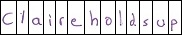

# Handwriting Characters Extractor

Purpose: to extract all the individual characters from a handwriting manuscript containing multiple lines. Using Python and OpenCV write a program that reads a image file containing a scanned page of
handwriting text containing multiple lines e.g.

and:

a) Extract, display and save individual lines of text. E.g.

b) Extract, display and save individual characters from each line of text. E.g.

Obs:

- You can choose the way to display results.
- The algorithm should be tested on more than one page.
- No other libraries should be used except OpenCV